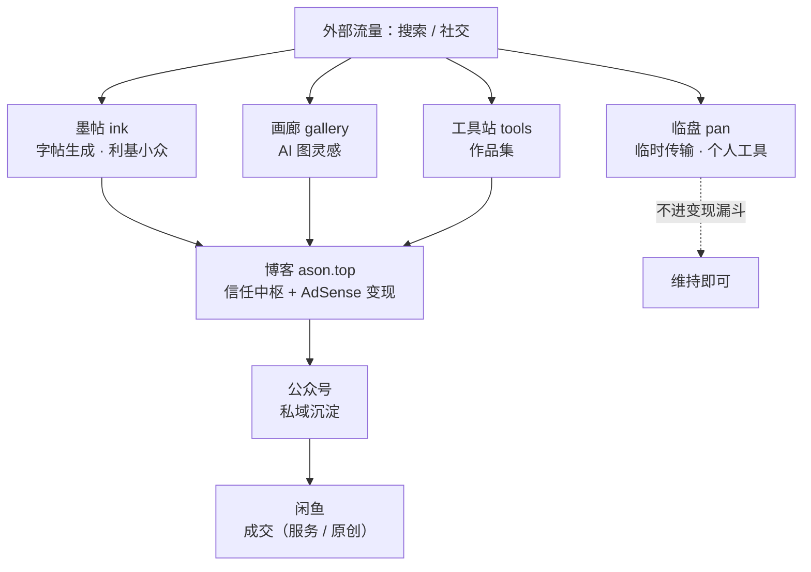
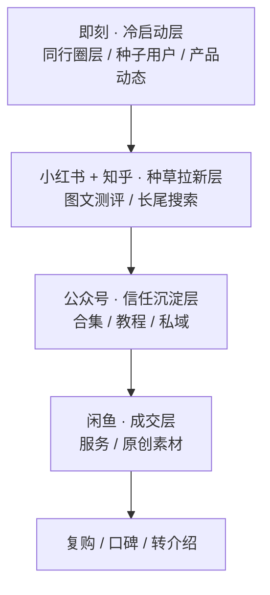

> ⚠️ **发布前必读**：本文已加 `draft: true`，构建时不会出现在线上列表，也不会进入 sitemap（sitemap.ts 已过滤 draft）。确认要公开发布时，**手动删除 frontmatter 里的 `draft: true` 这一行**。
> 本文用途：**个人战略梳理**（非对外招商稿）。第六节含 P0 级版权风险，务必先看。
> **身份前提**：作者是**纯个人，无个体户 / 一人公司 / 营业执照**。凡涉及"站内收款、微信小商店、微信支付商户号"的方案，本文一律剔除——这些都需要经营主体。

---

## 战略总纲（v1.10 · 一句话版）

> **全站当前唯一的真问题不是产品，是"没有流量"。** 产品与漏斗已大体清晰，瓶颈在获客。

**战略一句话**：集中每周约 7 小时，用「小红书国风内容 + 博客素材教程」给**闲鱼（国风/AI 素材 + 定制服务）**带货，先把"0 单"跑成"首单"；博客 AdSense 与公众号（满 500 粉后流量主）做站内 / 私域现金补充；墨帖低成本上线保有、临盘 / 画廊 / 小程序维持、工具站已放弃。

**优先级（受 7h/周约束）**：① 闲鱼合规核查（P0 底线，不合规一切免谈）→ ② 博客起量（站内现金引擎）+ 小红书国风带货（闲鱼曝光源）→ ③ 墨帖低成本上线（利基保有）、公众号周更；知乎禁言挂起、解禁后补。

**90 天唯一硬指标**：闲鱼跑出首单 + 博客开始有搜索自然量。现金牛是"候选"不是"现实"，别提前谈规模化。

---

## 一、四句话结论（v1.10 校正版）

1. **两笔账都还没跑通，但路径是清楚的**。博客 AdSense 已接入、只缺流量；闲鱼是唯一平台"成交场"，但后台实测**累计销量仍为 0**（见 3.5）——变现尚未验证。"现金牛"目前是候选而非现实。真正该做的是先把引流跑起来（博客 + 公众号 + 小红书国风内容对齐闲鱼货盘），让其中至少一条先出单 / 出量；墨帖作低成本保有、非主线。之前设想的"工具站站内收款"因你无经营主体已作废。
2. **墨帖是利基但合规保有的产品**：它有用（字帖 PDF 生成）、授权天然合规（OFL 字体）、与字体主线相关，但**用户群窄**（主要是练字人群 / 宝妈）、且**自然流量为 0**（v1.10 确认），天花板有限——**不当主攻，当"低成本保有 + 顺带引流"**。其余三站（工具站 / 临盘 / 画廊）要么是红海、要么是个人工具、要么低价值。
3. **工具站已决定放弃**：SEO 死透是战略选择错误（英文通用工具红海、零差异化），作者确认不再投入——认作品集状态、停止加新工具，从优先级与 90 天清单中移除。
4. **🚨 闲鱼真实货盘是"国风 / AI 素材 + 定制"，不是练字**：8 款里仅 1 款（0110 字体）与练字相关，墨帖（练字 PDF）与闲鱼主力货不对板——墨帖要么独立成线（靠博客 AdSense + 自身搜索），要么借 0110 字体款与闲鱼联动，需决策（见 3.5）。同时这也修正了"小红书国风内容错位"的旧判断：国风内容是为闲鱼国风货带货的，方向对。

---

## 二、产品矩阵

### 2.1 四象限定位图

坐标轴：**横轴 = 变现能力**（能不能带来钱，对个人而言=内容广告 / 平台内变现的可行性），**纵轴 = 流量获取能力**（能不能稳定带来人）。

> 坐标轴：**横轴 = 变现能力**（右强左弱），**纵轴 = 流量获取能力**（上高下低）。下表即四象限定位。

| 流量获取能力 ＼ 变现能力 | 变现强（右）                                                                                                                     | 变现弱（左）                                                                                                              |
| :----------------------: | :------------------------------------------------------------------------------------------------------------------------------- | :------------------------------------------------------------------------------------------------------------------------ |
|       **高（上）**       | **☆ 利基（小众）**：墨帖 `ink.ason.top` 字帖 PDF 生成器——有用 + 授权合规（OFL），但用户群窄（练字/宝妈），低成本保有、非主攻 | **流量池 / 作品集**：临盘 / 画廊 / 工具站 临盘 = 个人临时传输工具（**不进变现漏斗**）；画廊 / 工具站 = 作品集，离钱远 |
|       **低（下）**       | **◆ 现金牛候选**：博客 `ason.top` 已接 **AdSense 内容广告**——个人合规、无需营业执照，是站内唯一能变现的资产（只缺流量）      | **长尾 / 期权**：小程序·陇中乡音词典 未微信认证 = 微信搜不到、无流量主，暂缓                                          |

**一句话判断**：右下角"现金牛候选"是**博客（AdSense）**（只缺流量）；右上角"明星"**暂空缺**——墨帖已降级为"利基小众"（用户群窄、不主攻）；工具站已确认放弃、认作品集。

### 2.2 产品清单表

| 产品                | 地址             | 实际定位（校正后）                          | 矩阵角色                    | 流量来源                                                         | 变现方式（个人可行）                                  | 优先级                   |
| ------------------- | ---------------- | ------------------------------------------- | --------------------------- | ---------------------------------------------------------------- | ----------------------------------------------------- | ------------------------ |
| ASoN 博客           | ason.top         | 个人主站 / 内容资产 / **AdSense 现金引擎**  | 信任中枢 + 现金牛候选       | 搜索引擎（SEO）                                                  | **AdSense 内容广告**（已接入）                        | **P0 起量**              |
| 墨帖                | ink.ason.top     | 硬笔字帖 PDF 生成器（半成品）               | **利基（小众）**            | 搜索（"字帖生成 / 练字 PDF"，词竞争小但用户群窄：练字人群/宝妈） | 导流向博客(广告) + 闲鱼（低优先，借 0110 字体款联动） | 低成本保有，打磨但不主攻 |
| 工具站              | tools.ason.top   | 英文通用开发者工具箱（40+ 工具）            | 长尾 / 作品集（已放弃投入） | 搜索（红海，几乎为零）                                           | 无                                                    | 已放弃（认作品集）       |
| 临盘                | pan.ason.top     | 临时文件传输工具（HF 搭建，6–24h 过期即删） | 基础设施 / 个人工具         | 搜索（"临时网盘"，但与变现无关）                                 | 无                                                    | P3 维持                  |
| 画廊                | gallery.ason.top | AI 图灵感展示                               | 长尾 / 作品集               | 搜索 + 社交                                                      | 弱                                                    | P3 观察                  |
| 小程序·陇中乡音词典 | 微信（未认证）   | 方言词典                                    | 期权（已死）                | 微信搜索（未认证则搜不到）                                       | 无                                                    | P4 暂缓                  |

### 2.3 产品间的流量 / 变现关系

> 上图为 Mermaid 框图，VS Code / GitHub 预览可直接渲染；博客（contentlayer）暂未装 Mermaid，发布前需装 `rehype-mermaid` 或退回表格。

**关键修正**（对比 v1.1）：

- **临盘不在主链路里**。它是你个人的临时传输工具（文件 6–24h 删除），不产生内容、不沉淀用户，不属于"引流 → 变现"漏斗。把它当基础设施就好。
- **博客本身就是收口**：访客在任意子站认识你 → 回到博客（信任中枢）→ 博客内的 **AdSense 广告**就是站内变现点。这是个人无需营业执照也能跑的通路。
- 墨帖是"导流向博客"的最佳节点：用户用完字帖生成器，天然会点"关于作者"回博客。

### 2.4 逐产品判断

#### ☆ 墨帖 ink.ason.top —— 利基低成本保有

- **它到底是什么**：硬笔字帖生成器。选字体 → 输入内容（古诗 / 字词）→ 实时预览 → 一键导出 A4 PDF 打印即练。范字用的是**可免费商用的开源字体（OFL）**。
- **为什么仍值得低成本保有**：① 真正有用、授权合规（OFL 字体，无二次转卖风险）；② 与"字体 / 书法"主线相关，能和博客内容互导；③ "字帖生成 / 练字 PDF"是中文长尾词，竞争远小于工具站的英文 dev 词。但**用户群窄**（练字人群 / 宝妈），天花板有限——不主攻、半成品先上线即可。
- **当前状态**：你说是"半成品"。最该补的是：① 完成度（生成 / 下载闭环稳定）；② 基础 SEO（补 meta description + og 图，目前缺，见 2.5）；③ 在页脚 / 关于处回链博客。
- **Non-goals**：不做字体社区、不做在线设计、不卖字体文件（合规风险，见 6.1）。导流落点：闲鱼当前无"定制字帖"款，墨帖变现可借 0110 字体款或新增定制字帖款承接（见 3.5）。

#### ■ 博客 ason.top —— 现金牛候选（P0，内容起量）

- **它到底是什么**：终端风格的個人博客，2026-08 起集中写技术笔记 / 项目复盘 / 日常。SEO 基建是六个站里最完整的（见 2.5）。
- **为什么是现金牛候选**：已接入 **AdSense 自动广告**——内容有流量就有广告收入，**个人完全可做，不需要营业执照**。这是你唯一"站内变现"的资产。
- **下一步**：保持更新、把 SEO 做起来（中文长尾词 + 内链 + 外链），让 AdSense 起量。它也承载墨帖的信任背书与回链（工具站已放弃投入，仅留作作品集）。

#### ● 工具站 tools.ason.top —— 已放弃（认作品集）

- **它到底是什么**：40+ 英文通用开发者工具（图片压缩、JSON、时间戳、哈希、PDF、正则……）。你做最久、SEO 最差。
- **SEO 死透的根因**（已实地确认）：robots.txt 是 `Allow: /`、sitemap.xml 已提交——**没被屏蔽**。问题是内容本身：① 英文通用 dev 工具，全球红海，对手是 TinyPNG / JSON.cn 级别；② 零差异化、页面薄、零外链；③ 域名较新、无权重。这是战略选择错，不是 bug。
- **决策（v1.9）**：作者确认**放弃投入**——认作品集状态、停止加新工具、不再做转型或 SEO。原因：既做不成现金牛（无营业执照无法站内收款），又不与国风 / 字体主线协同，且每周仅约 7 小时应优先给闲鱼合规与博客起量。
- **Non-goals**：不再扩通用工具、不做视频转码 / AI 生成等重成本工具；不再为它投入时间。

#### ● 临盘 pan.ason.top —— 维持（P3，不在漏斗内）

- **它到底是什么**：基于 HuggingFace 的临时文件传输服务，6–24h 过期即删，Cloudflare 加速，无需注册。
- **判断**：这是你**个人的工具**，不是引流产品。它不生产内容、不沉淀用户、不进入变现漏斗。SEO 上可冲"临时网盘 / 临时文件分享"中文词，但和你的变现矩阵无关。
- **下一步**：维持即可；若想让它有点用，补 meta description + og，并回链博客做信任。不要在这上面投入变现设计。

#### ● 画廊 gallery.ason.top —— 观察（P3）

- **它到底是什么**：AI 生成图灵感墙（带 prompt 和参数展示）。
- **判断**：低价值、低复用，用户看一眼就走。Server-rendered，SEO 没问题但没意义。
- **下一步**：暂不投入。可降级为博客的一个页面，或仅作作品集。

#### ■ 小程序·陇中乡音词典 —— 暂缓（P4）

- **卡点**：未微信认证 = 微信搜不到、无流量主、无支付、不能分享朋友圈。等于没人能找到的产品。
- **判断**：方言词典长尾价值真实，但**不认证就毫无意义**，且认证需 300 元/年（个人可承担但当前不优先）。
- **下一步**：等墨帖 + 博客跑通后再回头捡；现在雪藏。

### 2.5 各站 SEO 体检（2026-08-29 实地访问）

| 站点                 | 渲染   | robots       | sitemap | OG/描述                                | 结论与首要动作                                                          |
| -------------------- | ------ | ------------ | ------- | -------------------------------------- | ----------------------------------------------------------------------- |
| **ason.top**         | SSR ✅ | Allow ✅     | 已交 ✅ | 有 OG；首页 title 偏品牌缺词（已补全） | **优**。GSC/Bing 验证 + IndexNow + AdSense 全有。只需持续产出内容做 SEO |
| **ink.ason.top**     | SSR ✅ | 未见 noindex | —       | **缺 meta description / og 图**        | **良**。补 description + og，冲"字帖生成"中文词                         |
| **tools.ason.top**   | SSR ✅ | Allow ✅     | 已交 ✅ | 有基础 meta                            | **差（战略问题）**。内容红海零外链，转型或作品集化                      |
| **pan.ason.top**     | SSR ✅ | —            | —       | 有描述                                 | **中**。功能清晰，补 meta/og + 回链博客即可                             |
| **gallery.ason.top** | SSR ✅ | —            | —       | 有描述                                 | **中**。低价值，可降级为博客页                                          |

> 共同点：五个站都是 **SSR（服务端渲染）**，搜索引擎都能看到内容——所以"不被收录"只发生在工具站，且原因是内容竞争力，不是技术屏蔽。

---

## 三、带货矩阵

### 3.1 渠道漏斗图

> 博客（AdSense）是**独立的站内变现场**，不在这条平台漏斗内——它靠内容广告直接变现，无需经过这些平台。
> 上图同样为 Mermaid 框图，VS Code / GitHub 预览可渲染；博客发布前需装 `rehype-mermaid` 或退回表格。

### 3.2 渠道定位矩阵

坐标轴：**横轴 = 流量天花板**，**纵轴 = 变现直接度**。

闲鱼是唯一的"成交场"，小红书 / 知乎是"种草拉新场"，公众号是"沉淀场"，即刻是"冷启动场"。**新增一层认知**：博客本身是"变现场"（AdSense），不依赖这些平台。（注：知乎账号当前被禁言，该渠道暂挂起；小红书内容为国风 / 猫咪——国风部分与闲鱼主力国风货匹配，见 3.5 修正结论）

### 3.3 渠道分工表

| 平台                | 漏斗层级     | 内容形态                              | 建议节奏    | 关键动作                                                                                                               | 北极星指标                     |
| ------------------- | ------------ | ------------------------------------- | ----------- | ---------------------------------------------------------------------------------------------------------------------- | ------------------------------ |
| **博客（AdSense）** | 站内变现     | 长文 / 技术笔记                       | 周更 1–2 篇 | 中文长尾词 + 内链 + 回链子站                                                                                           | 广告收益 / 自然流量            |
| **闲鱼**            | 成交         | 商品货架                              | 上新即维护  | 主图统一、标题埋词、描述强调"服务"；✅ 18 款字体全可商用；⚠ 后台累计销量全 0，变现未跑通（见 3.5）                     | 首单 / 月成交额 / 客单价       |
| **公众号**          | 沉淀         | 合集、长教程                          | 周更 1 篇   | 结尾留钩子；500 粉开**流量主**（现 30+ 粉，长期目标）                                                                  | 关注净增（现 30+）/ 流量主收益 |
| **小红书**          | 种草         | 图文（国风图片 / 猫咪）               | 周 3–5 条   | 首图强视觉、埋长尾词；⚠ 国风内容其实匹配闲鱼主力国风货（见 3.5），"猫咪"部分需取舍；是否切练字垂类按闲鱼货盘而非墨帖定 | 笔记曝光 / 收藏率              |
| **知乎**            | 种草（长尾） | 回答 + 文章（⚠ 当前禁言，渠道暂挂起） | 周 2–3 答   | 解禁后再做；仍是 SEO 长尾首选                                                                                          | 回答排名 / 主页访问            |
| **即刻**            | 冷启动       | 产品动态、随笔                        | 随手发      | 混圈、同量级互推                                                                                                       | 互动数 / 导流点击              |

### 3.4 内容 ↔ 货品匹配表（一次生产，多次分发）

同一份素材在多个平台复用，是低成本关键：

| 素材源          | 博客           | 小红书         | 知乎               | 闲鱼             | 公众号   |
| --------------- | -------------- | -------------- | ------------------ | ---------------- | -------- |
| 墨帖使用教程    | 长文 + AdSense | 9 图"练字神器" | 回答"怎么练硬笔"   | 「定制字帖」服务 | 合集     |
| 字体 / 练字科普 | 长文           | 避坑图文       | 回答"免费商用字体" | 字帖模板         | 教程     |
| 开发踩坑复盘    | 长文 + AdSense | 代码卡片       | 回答技术题         | —                | 技术随笔 |

**一次生产，五次分发**。别为每个平台单独做内容。

### 3.5 闲鱼货品清单（后台实测 · 2026-08-29，含真实商品名）

> 来源：闲鱼卖家后台在售列表 + 用户补充的商品名（按列表上下顺序一一对应）。**累计销量字段全部为"—"（即 0）**，说明该账号目前**尚无公开成交记录**——闲鱼虽是唯一搭建好的"成交场"，但变现尚未跑通。

| 尾号 | 商品（实测名称）                      | 标价        | 粉丝价   | 库存  | 类别        | 与练字主线 | 状态   |
| ---- | ------------------------------------- | ----------- | -------- | ----- | ----------- | ---------- | ------ |
| 5605 | 国风古城山水手机壁纸（8张）           | ¥3.99       | ¥1.99 起 | 100   | 国风素材    | 无关       | 在售   |
| 3637 | 61张AI岩彩敦煌图（千年壁画→赛博朋克） | ¥9.90       | ¥4.99 起 | 100   | 国风/AI素材 | 无关       | 在售   |
| 6014 | 64个朝代印章素材（上古→民国，1比1）   | ¥9.90       | ¥4.99 起 | 100   | 国风素材    | 无关       | 在售   |
| 3704 | 270个AI智能体(Skill)专家提示词        | ¥19.90      | —        | 100   | AI提示词    | 无关       | 在售   |
| 0110 | 18款精选中文字体（楷书/手写/毛笔…）   | ¥1.99~4.99  | —        | 110   | **字体**    | **相关**   | 在售   |
| 5716 | 32种风格AI图片定制                    | ¥9.90~29.90 | —        | 120   | 定制服务    | 无关       | 已下架 |
| 8221 | 资源代找·明码标价不收费               | ¥2.90       | —        | 10000 | 代找服务    | 无关       | 在售   |
| 4381 | 专属定制（0基础网站/APP）             | ¥29.90      | —        | 10    | 定制服务    | 无关       | 在售   |

**从这份清单读出的事实（v1.7 关键修正）**：

1. **变现尚未验证**：8 个链接累计销量全为 0。"闲鱼=唯一成交场"是**假设**非事实。当前确定的现金流只有博客 AdSense（也缺流量）——两笔账都待验证。
2. **🚨 货盘结构暴露真实主线 ≠ 练字/字体**：8 款里**只有 1 款（0110 字体）**与"练字/字体"主线相关，其余 7 款全是**国风素材（壁纸/敦煌/印章）+ AI素材（提示词/图片定制）+ 定制服务（代找/网站APP）**。→ 你实际在做的是**"国风 / AI 素材 + 定制服务"矩阵**，墨帖（练字 PDF）反而是个与货盘对不上的孤立产品。
3. **这修正了"小红书内容错位"的判断**：v1.5 认为小红书发国风/猫咪与练字主线错位——但闲鱼主力货正是国风素材，所以**国风内容其实是为闲鱼国风货带货的，方向对**；偏差只在"猫咪"那部分（与任何货都无关）。是否切练字垂类，应重新按"闲鱼货盘"而非"墨帖"来定。
4. **价格带三档**：走量 ¥1.99–3.99、主力 **¥9.90**（3 款，最该保）、定制/服务 ¥19.90–29.90。
5. **库存不规范**：8221 库存 10000（虚拟备货正常）、4381 仅 10（限量/定制）。建议虚拟品统一 9999。
6. **粉丝价已用**（3 款，低至 ¥1.99），方向对，但需先有首单才有复购。

> ⚠️ **版权/合规风险未完全解除**：你原话"18 款字体全可商用"指的是 **0110 这一款**（含 18 款字体），已清；**其余 7 款版权状态各异，且不能默认安全**：
>
> - **8221 资源代找**：帮人找资源，若涉及盗版/侵权资源，属平台违规 + 法律风险，建议下架或改为"合法资源导航/教程"
> - **6014 印章素材"1比1"**：若为他人设计再分发，需确认授权
> - **3637/5605 AI 图、3704 提示词**：自生成通常可商用，但需确认生成平台条款；"整理打包他人提示词"有归属争议
>   → 详见 6.1，版权 P0 从"已解除"改回"**字体款解除，其余 7 款待逐款核查**"。

### 3.6 素材 / 设计资料变现打法（实操）

> 基于 3.5 的货盘事实（闲鱼主力是国风/AI 素材 + 定制服务），结论很明确：**把你手上的素材/设计资料当卖点完全可行，而且是你当前最现实的变现路径**——比墨帖更快出单。前提是"卖法"合规、卖点清晰。下面给可直接执行的打法。

**A. 选品底线：4 类能卖，4 类别碰**

| 能卖（合规）           | 说明                          | 对应现有款                                          |
| ---------------------- | ----------------------------- | --------------------------------------------------- |
| ① 自生成 / 原创素材    | AI 图、自设计模板，版权归你   | 5605 壁纸、3637 敦煌、6014 印章(若自设计)、原创 PPT |
| ② CC0 / 公共领域精选包 | 卖"整理 + 检索效率"，不卖版权 | 合法免费素材合集                                    |
| ③ OFL 字体精选包       | 随包附授权文件                | 0110 字体（已清）                                   |
| ④ 定制服务             | 卖时间不卖文件，最安全        | 4381 网站/APP 定制、图片定制、8221 改造后           |

| 别碰（高危）                   | 风险                                 |
| ------------------------------ | ------------------------------------ |
| 付费字体 / 素材再分发          | 侵权，厂商批量维权，单款赔数千至数万 |
| 资源代找涉盗版（8221 现状）    | 平台违规 + 违法                      |
| 禁止转售的"可商用"字体转售     | 授权违约                             |
| 他人付费图库打包（视觉中国等） | 侵权                                 |

**B. 卖点包装四要素（闲鱼打法）**

1. **标题埋词 + 显价值**：现有「64个朝代印章素材 上古到民国 国风1比1 设计课件PPT」结构就很好（数量 + 主题 + 用途）。补一句"本人整理/原创"即可。
2. **主图拼缩略**：把素材缩略图拼一张，国风强视觉天然适合首图。
3. **描述三句话**：① 本人原创/自整理、可商用；② 附授权/使用说明；③ 强调"资料 + 教程"，弱化"文件"一词（降违规感、也降买家"买了就走"预期）。
4. **价格守三档**：走量 ¥1.99–3.99 引流、主力 **¥9.90** 保本（别盲目降价）、定制 ¥19.90–29.90。

**C. 与矩阵联动**

- **小红书发国风内容 → 给国风货（壁纸/敦煌/印章）带货**，方向正确（v1.7 已校正）；"猫咪"内容与任何货无关，建议砍掉或另开号。
- **博客写"国风素材怎么挑/怎么用/可商用字体清单"教程** → 接 AdSense + 文内软链闲鱼。
- **公众号做合集教程**沉淀私域。
- 墨帖（练字）与货盘弱相关，要么借 0110 字体款联动、要么独立成线，不强行混。

**D. 你 8 款的执行动作（一表）**

| 款                    | 卖点                        | 合规动作                                        |
| --------------------- | --------------------------- | ----------------------------------------------- |
| 5605 国风壁纸         | AI 国风壁纸 8 张            | 标"AI 生成·可商用"，保留生成记录                |
| 3637 敦煌图           | 千年壁画 → 赛博朋克风格跨度 | 同上，强调风格稀缺性                            |
| 6014 印章素材         | 朝代印章 1:1 课件           | 确认自设计；自设计标原创，他人设计需授权        |
| 3704 提示词           | 270 个 AI 智能体提示词      | 标"本人整理/自用经验"，避免"打包他人付费提示词" |
| 0110 字体             | 18 款中文字体               | 维持，OFL 随包附授权                            |
| 8221 资源代找         | ⚠ 高危                      | 改"合法资源导航教程"或直接下架                  |
| 4381 网站/APP 定制    | 0 基础定制                  | 服务类，安全，强调"交付物归你"                  |
| 5716 图片定制(已下架) | AI 图片定制                 | 服务类，可重新上架                              |

> 一句话：**素材能卖，但把"我整理 / 我原创 / 我服务"写在明面上，把"别人的版权文件"摘出去。** 这是你当前最现实的现金路径。

### 3.7 国际图片变现 —— 已评估，放弃（不进 90 天主线）

> 基于 v1.10 后两轮评估（渠道：Reddit / Quora / Pinterest；图库：Shutterstock / Adobe Stock / Getty），结论：**卖图片的国际变现路线对当前阶段不划算，放弃。** 理由有三层。

**A. 渠道错配（Reddit / Quora / Pinterest）**

- 你的成交场是闲鱼（中国买家、人民币），国际英文流量接不进闲鱼闭环。
- 路 A（纯品牌铺垫）ROI 低；路 B（开国际线）需另建 Gumroad / Etsy 收美元——是全新业务线，不是给闲鱼导流。
- 即便想验证，也只值「30 分钟/周 Reddit 发图实验」，跑通国内首单后再说。

**B. 图库授权（Shutterstock / Adobe Stock）—— 卖图片本身不划算**

| 平台         | 收 AI 投稿？                                       | 结论                                                                     |
| ------------ | -------------------------------------------------- | ------------------------------------------------------------------------ |
| Shutterstock | ❌ 明确拒绝投稿者 AI 图（官方 FAQ）                | 不可行，直接排除                                                         |
| Getty Images | ❌ 不收                                            | 不可行                                                                   |
| Adobe Stock  | ✅ 收（提交时勾"Created using generative AI"声明） | 可行但长尾：新号单图约 \$0.1–0.3，需传几百~几千张才稳定，前 3 个月基本 0 |

- 核心问题：图库是**量级游戏**，与「7h/周 + 闲鱼 0 单」冲突，会分散弹药。
- 国风/AI 图若想卖动，得改成商业可用类型（商务/生活方式/节日/科技），纯艺术图无人买授权——又是一笔额外投入。

**C. 唯一例外：Gumroad / Etsy 打包卖（仍非当下主线）**

- 未来真想试国际，优先 Gumroad / Etsy **打包卖**（客单价高、你掌控定价、个人可开无需执照），而非图库长尾。
- 当下 90 天主线仍是国内闲鱼首单 + 博客 AdSense，国际线一律不排期。

**D. 重要区分：别顺手放弃闲鱼的「图片类货」**

- 本节放弃的是**国际图库授权卖图**这条路；闲鱼已有的 3 款图片货（5605 壁纸、3637 敦煌、6014 印章）仍属核心货盘——打包卖、一次几块钱、面向国内买家，与 Shutterstock 那套不是一回事，照常做（见 3.6）。

### 3.8 国内变现渠道备选评估（闲鱼 + 其他点子）

> 用户问"国内的闲鱼，这个能做吗？还是有其他好点子？"——先给结论：**闲鱼能做、且是当下最该做的**，但你累计 0 单 的根因不是平台不行，是**引流断链**。下面把闲鱼和几个国内备选一起评估。

**A. 闲鱼能不能做？——能做，但先修引流**

- **优势**：国内最大闲置/二手流量池、个人零门槛开店、虚拟商品可上（有"数字商品"类目）、自带搜索流量与粉丝价机制。
- **你 0 单 的真正原因（不是平台问题）**：小红书国风内容还没起量、博客还没自然搜索量——**没有流量源把人引到闲鱼**，链接再好也无曝光。所以"闲鱼能做吗"的答案是"能做，但得先把 3.6 / 90 天里的引流跑起来，才有意义"。
- **仍要守两条线**：① 版权合规（6.1，尤其 8221 资源代找）；② 平台规则——虚拟商品避免重复铺货、不硬放站外链接，否则限流/下架。

**B. 核心认知：素材是"一次生产、多处分发"的资产**

- 你手上的国风/AI 图/印章/PPT 课件素材，本质是**可复用的内容资产**——同一套能在多个渠道同时用，边际成本近零。放大变现的关键不是开 N 个新号，而是**把同一套货铺到更多适配渠道**。

**C. 国内其他点子（按"纯个人 / 无执照 / 低时间 / 与货盘协同"筛选）**

| 渠道                    | 个人可做？                             | 与货盘协同                              | 时间成本           | 定位                 |
| ----------------------- | -------------------------------------- | --------------------------------------- | ------------------ | -------------------- |
| **公众号流量主**        | ✅ 满 500 粉自动开，内容广告，无需执照 | 高（写素材教程养粉）                    | 低（复用博客文）   | 站内现金补充，最确定 |
| **爱发电 afdian**       | ✅ 赞助 / 付费内容 / 会员，个人可做    | 中（铁粉赞助）                          | 低                 | 私域补充             |
| **百度文库 / 道客巴巴** | ✅ 传文档卖，个人可做                  | 高（印章 PPT 课件 / 字帖特别适合）      | 低（复用现有素材） | 被动长尾收入         |
| **微信私域（朋友圈）**  | ✅ 个人号即可                          | 高（卖 4381 / 5716 定制服务，转化率高） | 低                 | 高转化补充           |
| 小红书店铺              | ⚠ 笔记带货需权限，个人店类目受限       | 中                                      | 中                 | 暂不主推，引流为主   |
| 抖音 / 视频号小店       | ❌ 门槛高、视频时间成本大              | 低                                      | 高（7h/周不够）    | 暂不做               |
| 淘宝 / 拼多多个人店     | ❌ 保证金 + 部分需执照                 | —                                       | 高                 | 放弃                 |
| 知识星球 / 小报童       | ⚠ 需内容积累，0 粉难起                 | 中                                      | 中                 | 暂不做               |

**D. 结论：闲鱼主攻 + 三层补充**

- **主攻**：闲鱼（国风 / AI 素材 + 定制），先把引流跑通、跑出首单。
- **最确定补充**：公众号流量主（已有 30+ 粉，冲 500）。
- **低成本被动补充**：百度文库卖课件 / 字帖（复用素材）、爱发电（铁粉）、微信私域卖定制（4381 / 5716）。
- **不碰**：淘宝 / 拼多多 / 抖音小店（门槛或时间不符）。

---

## 3.9 首单为什么还跑不出来——诊断与最小验证

> 用户原话："现在连首单都跑不了，感觉有点方向错了。" —— 2026-08-29 下午出现的战略性质疑。本章**不直接推翻** v1.10–v1.12 的结论，而是先做**归因诊断**：把"0 单"拆成"没人看 / 看了不买 / 根本没需求"三层，定位到底卡在哪，再决定是"调执行"还是"改方向"。

**A. 先别急着推翻方向：0 单 ≠ 方向错**

冷启动期 0 单是常态。闲鱼本身有**站内免费流量池**（搜索 / 猜你喜欢 / 擦亮），不依赖小红书、博客也能拿到曝光。所以"跑不出首单"最可能不是"卖素材这个方向错"，而是**某一层漏斗漏了**。关键是用一个零成本实验把漏点找出来，而不是凭感觉换方向。

**B. 三层归因框架（决定下一步动作）**

| 你后台看到的信号             | 漏在哪一层     | 说明                                                         | 下一步动作                                                         |
| ---------------------------- | -------------- | ------------------------------------------------------------ | ------------------------------------------------------------------ |
| 商品 **0 浏览 / 0 想要**     | **曝光层**     | 标题词 / 类目 / 权重没接到闲鱼站内流量，没人看到链接         | 先不碰外部渠道：每天擦亮、标题埋高频词、用闲鱼币小额推广冲曝光     |
| 有浏览但 **0 想要 / 0 咨询** | **转化层**     | 人来了但不心动：主图弱、价格高、描述没钩子、或货不对搜索意图 | 改主图（拼缩略图）、降价到 ¥0.99 测转化、补"可商用 / 本人整理"描述 |
| 站内 + 外部 **长期都 0 量**  | **可能方向错** | 需求弱、或货与买家不匹配                                     | 才谈"方向重选"（见 D）                                             |

> ⚠️ 判断开关数据：**已回（2026-08-29 晚，见 3.9 E）**——闲鱼后台实测 5 款合计仅 169 次曝光、5 次浏览、0 成交。结论：**漏点在曝光层 + 点击层**（非转化层、更非方向错），直接命中本节「曝光层」分支，7 天验证实验即日可开跑。

**C. 7 天纯站内最小验证实验（不花外部精力）**

目标：在不依赖小红书 / 博客冷启动的前提下，先验证"闲鱼站内能不能出单"，定位漏点。

1. 选 1 款做实验品（建议 **3637 敦煌图 ¥9.90**，视觉强、易做主图）
2. 每天「擦亮」+ 标题埋高频词（国风壁纸 / 手机壁纸 / 敦煌壁纸 / 微信头像背景）
3. 主图拼 4–6 张缩略图，首图强视觉
4. 用闲鱼币做小额推广（或降价到 ¥0.99 冲 3 天看转化；注意虚拟品降价易引羊毛党，仅作测试）
5. **7 天后看**：浏览 / 想要 / 是否有咨询或成交

- 有浏览有想要 → 曝光 OK，调转化即可，**方向没错**
- 0 浏览 → 曝光层问题，闲鱼站内 SEO 基本功（标题 / 类目 / 擦亮）没做，先把这关过
- 纯站内也长期 0 → 才进入"方向重选"

**D. 什么情况下才谈"方向重选"（而非调执行）**

只有验证实验确认"站内 + 外部都拿不到任何量"时，才说明卖素材这条路在你身上跑不通。届时两条备选：

1. **转"内容现金"主线**：把 7 小时全砸博客内容（AdSense）+ 公众号（流量主），放弃卖货。最确定但慢，适合"不擅长销售 / 不喜欢客服"的人
2. **转"卖服务"主线**：你的 4381 / 5716 定制（网站 / APP）、合规化后的 8221（资源导航教程）本质卖的是时间和专业，成交靠私域信任而非货架曝光，闲鱼只是展示窗。服务客单价高、复购强，但需你愿意接需求、做交付

> 注意：以上两条都**不是现在就执行**，而是"验证实验失败后的备选"。当前动作 = 先做 7 天站内验证，拿到数据再决策。

### 3.9 E 后台实测数据回读（2026-08-29 晚）— 闭环诊断

> 用户从闲鱼卖家后台导出在售商品数据（窗口约近 7–30 天，导出区间 2026-08-22~08-28；本期仅含 5/8 款，缺 5605 国风壁纸 / 3637 敦煌图 / 6014 印章，见文末缺口说明）。

| 商品（尾号）       | 标价   | 曝光次数 | 曝光人数 | 浏览次数 | 浏览人数 | 询单  | 支付  | 曝光→点击 | 浏览→支付 |
| ------------------ | ------ | -------- | -------- | -------- | -------- | ----- | ----- | --------- | --------- |
| 0110 中文字体      | ¥1.99  | 97       | 84       | 5        | 3        | 0     | 0     | 5.2%      | 0%        |
| 3704 AI 提示词     | ¥19.90 | 46       | 41       | 0        | 0        | 0     | 0     | 0%        | –         |
| 4381 网站/APP 定制 | ¥29.90 | 13       | 13       | 0        | 0        | 0     | 0     | 0%        | –         |
| 8221 资源代找      | ¥2.90  | 9        | 7        | 0        | 0        | 0     | 0     | 0%        | –         |
| 5716 AI 图片定制   | ¥9.90  | 4        | 3        | 0        | 0        | 0     | 0     | 0%        | –         |
| **合计**           | —      | **169**  | **148**  | **5**    | **3**    | **0** | **0** | **3.0%**  | **0%**    |

**读出的三件事**：

1. **不是"方向错"，是"曝光都没拿到"**。5 款合计才 169 次曝光、5 次浏览、0 成交，日均总曝光 < 6 次。这不是转化差，是根本没人看见链接——典型的"挂了不动"休眠态（没擦亮、无活跃度、算法没学到标签）。
2. **曝光→点击也塌了**。唯一有点击的 0110 字体仅 5.2% 点击率，其余 4 款 **0 点击**。主图/标题缺钩子 + 休眠权重低，双重下拉。
3. **转化层尚无样本**。5 次浏览 0 成交，样本太小无法判断"看了不买"是否成立。→ 现在 100% 精力投在**曝光层 + 点击层**，转化层等有了浏览量再谈。

**这正好命中 3.9 B 的「曝光层」分支** → 动作明确：每天擦亮、标题埋高频词、小额闲鱼币推广冲曝光、改主图提点击。原 C 的"7 天纯站内验证"可以**立刻开跑，不必再等**。

**用数据选实验品（修正 C）**：原 C 建议 3637 敦煌图为实验品；但本数据中 0110 字体是 5 款里唯一有 CTR 信号、价格最低（¥1.99）、最易转化的一款，且已证明"便宜的数字字体在闲鱼有微弱但真实的需求"。建议：

- **主品 = 0110 字体（¥1.99）**：每天擦亮 + 标题埋"中文字体 免费商用 楷书 手写 可商用 打包下载" + 主图拼 18 款字体缩略图（强视觉首图）+ 描述强调"OFL 可商用 + 随包附授权"。目标：先把它跑出首单，验证"便宜数字素材能出单"这条路。
- **副品 = 3637 敦煌图（¥9.90）**：同样擦亮 + 埋"国风壁纸 / 手机壁纸 / 敦煌壁纸" + 主图拼缩略图。验证国风图片货的点击率。
- 7 天后回看：曝光是否↑、点击率是否↑、有无想要/咨询？
  - 曝光起不来 → 闲鱼站内 SEO 基本功（标题/类目/擦亮/活跃度）没做，集中补这关
  - 曝光起来但点击仍 0 → 主图/标题钩子问题（换首图再测）
  - 有点击有想要 → 方向对，调转化冲首单

> ⚠️ **数据缺口**：本表仅 5/8 款，缺 5605 国风壁纸 / 3637 敦煌图 / 6014 印章（恰是 3.6 认定的核心国风货盘）。若能把这 3 款后台数据也补齐，可进一步判断"国风图片货"的曝光/点击基线，决定主攻字体还是国风。建议下次导出时一并贴入。

### 3.9 F 小红书同日早发布信号（2026-08-29 11:00–15:06）— 平台内容验证

> 用户当天下午又贴了小红书截图：同一天内发了 5 条笔记，曝光/互动数据如下（数字极小，仅作相对信号，不作定论）。

| 笔记内容              | 发布时间 | 阅读 | 点赞 | 收藏 | 评论 |
| --------------------- | -------- | ---- | ---- | ---- | ---- |
| 手机壁纸·千里江山图   | 15:06    | 50   | 2    | 1    | 0    |
| 0 成本做蛤蜊壳风铃    | 12:18    | 37   | 3    | 0    | 0    |
| 产品矩阵方法论        | 11:27    | 0    | 1    | 0    | 0    |
| 18 款免费商用中文字体 | 11:13    | 11   | 2    | 3    | 0    |
| 64 方朝代印章         | 11:00    | 5    | 1    | 1    | 0    |

**读出的两件事**：

1. **壁纸内容 reach 最好，字体内容 intent 最高**。壁纸 50 阅读是小样本里最高，说明"国风手机壁纸"在小红书有更大的自然流量池；但字体 11 阅读带来 3 收藏（收藏/阅读 ≈ 27%）+ 2 点赞，说明看到的人意向更强。印章是更窄的利基（5 阅读、1 收藏）。
2. **产品矩阵方法论类内容不适合小红书**。0 阅读说明平台对"产品方法论 / 个人复盘"无分发——这类内容应只留在博客 / 公众号，不要发到小红书。

**对 7 天实验的修正**：

- **小红书侧**：**壁纸内容继续发**（国风山水 / 敦煌 / 印章素材图），它是最好的流量入口；**字体内容也继续发**但定位为"高意向钩子"，两者并行不互斥。猫咪 / 方法论类与货无关的内容砍掉。
- **闲鱼侧**：**主品仍建议 0110 字体**（它是闲鱼站内唯一有 CTR 信号），但应把小红书壁纸流量导向 5605 壁纸 / 3637 敦煌 / 6014 印章的闲鱼链接（版权合规前提下），并同步擦亮这 3 款；7 天后同时看字体和国风款的曝光 / 点击变化。
- 真正的"主攻哪类货"仍需补齐缺的 5605 / 3637 / 6014 闲鱼后台数据；当前信号只能说明：**小红书适合视觉钩子，闲鱼站内数据才决定成交**。

---

## 四、优先级排序（ICE 打分，已按"个人无执照"重排）

打分：Impact 影响面 / Confidence 信心 / Ease 容易度，各 1–10，取均分。

| 事项                                            | I                                                                        | C   | E   | 均分    | 排序    |
| ----------------------------------------------- | ------------------------------------------------------------------------ | --- | --- | ------- | ------- |
| 闲鱼在售货品版权核查（分阶段）                  | 字体款 0110 已清；其余 7 款（国风/AI/代找）待逐款确权，8221 资源代找优先 | 9   | 9   | 6       | **8.0** | 1   |
| 博客内容产出 + SEO 起量（AdSense 现金引擎）     | 9                                                                        | 8   | 7   | **8.0** | 1       |
| 墨帖打磨上线（补 SEO + 回链博客，半成品先上线） | 6                                                                        | 8   | 7   | **7.0** | 3       |
| 公众号稳定更新（现 30+ 粉，500 粉为长期目标）   | 7                                                                        | 8   | 6   | **7.0** | 2       |
| 小红书内容对齐（砍猫咪，集中国风为闲鱼货带货）  | 7                                                                        | 7   | 7   | **7.0** | 3       |
| 临盘 / 画廊补基础 SEO + 回链                    | 3                                                                        | 6   | 8   | **5.7** | 5       |
| 小程序微信认证                                  | 3                                                                        | 5   | 7   | **5.0** | 6       |
| 知乎长尾回答布局                                | ⚠ 禁言挂起                                                               | —   | —   | 挂起    | —       |

**先做 1（博客）+ 1（闲鱼版权核查）**：博客是站内现金引擎、闲鱼是唯一成交场，这两件优先级最高；受每周约 7 小时限制，墨帖降为低成本保有、公众号稳定更新排第 2。知乎因禁言暂挂起。

---

## 五、90 天行动清单

> 时间约束：每周约 7 小时，优先保「闲鱼合规核查 + 博客起量」，墨帖低成本保有穿插，其余顺延。

### 第 1–30 天：先合规、搭骨架

- [ ] **P0 闲鱼版权核查（分阶段）**：0110 字体款已清（留存授权截图）；其余 7 款逐款确权——8221 资源代找优先处理（改导航/下架），6014/5605/3637/3704 确认自生成 or 授权（见 6.1）
- [ ] 墨帖：半成品先上线（跑通生成 / 下载即可），补 meta + 回链博客；不追求完美，低成本保有
- [ ] 博客：保持周更 1–2 篇，主攻中文长尾词（练字 / 字体 / 独立开发 / 国风素材），让 AdSense 开始有展示
- [ ] 公众号：稳定更新，先把粉丝从 30+ 拉到 100+（500 粉开流量主是长期目标，不卡死在 30 天）

### 第 31–60 天：起量

- [ ] **小红书内容对齐**：v1.7 已确认国风内容是为闲鱼国风货带货、方向对；只需**砍掉"猫咪"等与货无关的内容**，集中国风素材。不切练字垂类（与闲鱼货盘不符）
- [ ] 用数据挑出博客流量最好的 3 篇，反哺墨帖做成常青页（低成本）
- [ ] 知乎：当前禁言挂起；解禁后优先补"免费商用字体 / 怎么练硬笔"长尾回答

### 第 61–90 天：加固 + 分散

- [ ] 公众号：500 粉大概率未到，转为"持续更新 + 复盘涨粉瓶颈"，为流量主蓄力
- [ ] 博客内链 + 外链建设，AdSense 收益复盘
- [ ] 临盘 / 画廊补 meta/og + 回链博客（低成本）
- [ ] 复盘：画廊是否降级为博客页、小程序是否认证、小红书国风内容曝光数据

---

## 六、⚠️ 风险与合规（P0，必读）

### 6.1 版权与合规 —— 最高优先级（与个人身份无关）

> ⚠️ **2026-08-29 修正（v1.7）**：你原话"18 款字体全可商用"经核对，指的是闲鱼 **0110「18款精选中文字体」这一款商品**（含 18 款字体），该款版权已清；但闲鱼在售共 **8 款**，其余 7 款（国风壁纸 / 敦煌图 / 印章 / AI 提示词 / 图片定制 / 资源代找 / 网站 APP 定制）版权状态各异，**P0 风险并未整体解除，需逐款核查**。尤其 **8221「资源代找」** 若涉及盗版 / 侵权资源，属平台违规 + 法律风险，建议优先处理。

**问题**：你自己的公众号文案里写着——

> "字体版权归原作者所有，本店仅作整理打包……字体文件本身禁止二次转卖。"

"整理打包后售卖"本身就可能侵权。多数"免费商用"字体免费的是**使用权**，不等于允许你**二次分发并收费**。

| 授权类型         | 商用 | 二次分发/转售             | 举例                         |
| ---------------- | ---- | ------------------------- | ---------------------------- |
| SIL OFL          | ✅   | ✅ 通常允许（需保留协议） | 思源黑体、思源宋体、霞鹜文楷 |
| 厂商免费商用协议 | ✅   | ❌ 多数禁止               | 阿里巴巴普惠体、站酷系列     |
| 个人/演示授权    | ❌   | ❌                        | 大量书法体                   |

**好消息**：**墨帖用的就是 OFL 开源字体**，授权天然合规，这条路可以放心走；闲鱼 0110 字体款也已确认可商用。
**整改建议（按紧迫度）**：

1. **🔴 资源代找（8221）优先处理**：帮人找资源，一旦涉及盗版 / 侵权资源即违规 + 违法。改为"合法资源导航 / 检索教程"或直接下架
2. **🟠 印章（6014）/ 壁纸（5605）/ 敦煌（3637）/ 提示词（3704）逐款确权**：确认是自生成（保留生成记录）还是他人设计再分发（需授权）；自生成需核对生成平台商用条款，"整理打包他人提示词"有归属争议
3. **🟢 字体款（0110）维持**：严格限定 OFL，随包附原始授权文件并显著标注；"可商用"≠"可转售"，逐款留授权截图
4. **通用原则：卖服务而非文件**：字体授权核查、字帖定制 / 原创模板、安装配置指导——卖专业判断和时间，不涉及分发
5. **转向原创**：自制字帖模板、原创国风设计素材（与闲鱼主力货盘契合）

> 电商平台对字体 / 素材侵权响应快，近年有厂商批量维权先例。单款赔偿多在数千至数万元。这个风险不值得冒。

### 6.2 平台规则风险

| 平台   | 主要风险               | 规避方式                             |
| ------ | ---------------------- | ------------------------------------ |
| 小红书 | 站外导流被限流         | 不硬放链接，用"看主页 / 私信"软引导  |
| 知乎   | 硬广被折叠             | 先做纯干货攒权重，再软性提及         |
| 闲鱼   | 虚拟商品违规、重复铺货 | 一物一链接，描述强调"服务"而非"文件" |
| 公众号 | 诱导分享被罚           | 不用"转发才能领"话术                 |

### 6.3 结构性风险（个人视角）

- **无经营主体 = 不能站内收款**：微信小商店 / 微信支付商户号都要营业执照。个人能用的变现只有：**内容广告（AdSense / 流量主）+ 闲鱼（服务 / 原创）+ 爱发电（赞助）**。之前 v1.1 的"工具站付费解锁 / 微信小商店"方案已作废。
- **单点依赖**：当前收入尚无稳定来源（闲鱼累计 0 成交、博客 AdSense 待流量）。一旦未来闲鱼跑通，也需避免"账号出事即归零"——用博客 AdSense + 公众号流量主分散。
- **小程序未认证**：当前零曝光，不改变即沉没成本。

---

## 七、待你确认的问题（已剔除"营业执照"，因已确认无）

1. ~~⭐ 闲鱼在售具体是什么？~~ ✅ **已答（含后台数据 + 真实商品名）**：8 款货品已补全（见 3.5），价格带 ¥1.99~29.90、主力 ¥9.90、累计销量全 0（变现未跑通）。**关键修正**：货盘是"国风/AI 素材 + 定制"，仅 1 款字体与练字相关——闲鱼版权 P0 仅 0110 字体款解除，其余 7 款待查（见 6.1）
2. ~~**墨帖还差什么才能上线？**~~ ✅ **已明确**：用户群窄（练字人群/宝妈），降级为**低成本保有**——半成品先上线即可，不主攻、不追求完美
3. ~~**墨帖目前有自然流量吗？**~~ ✅ **已答：无自然流量**（v1.10 确认）——进一步坐实"利基低成本保有"定位，不当主攻、半成品先上线即可
4. ~~**你每周能投入多少小时？**~~ ✅ **已答**：每天约 1 小时（每周约 7 小时），90 天清单已按此重排（先保闲鱼合规 + 博客起量）
5. ~~公众号目前粉丝量？~~ ✅ **已答**：在持续更新，现 30+ 粉，离 500 粉流量主较远（长期目标）
6. ~~**工具站愿转还是认作品集？**~~ ✅ **已决：放弃**，认作品集状态、停止加新工具，不再投入（已从 ICE / 90 天清单移除）
7. ~~**闲鱼链接后台"浏览量/想要数"是多少？（3.9 B 开关数据）**~~ ✅ **已答（2026-08-29 晚，见 3.9 E）**：5 款实测合计 169 曝光 / 5 浏览 / 0 成交，漏点在曝光层+点击层（非转化层、非方向错），命中 3.9 B「曝光层」分支；7 天验证实验即日可开跑，主品改 0110 字体（¥1.99，唯一有 CTR 信号）

**新增渠道现状（2026-08-29）**：

- **小红书**：已开号，发国风图片 / 猫咪；v1.7 已校正——**国风内容方向对**（给闲鱼国风货带货），只需砍掉"猫咪"等与货无关内容，不必切练字垂类（见 3.6 / 90 天清单）
- **知乎**：账号被禁言，渠道暂挂起；解禁后仍是 SEO 长尾首选

---

_文档版本：v1.15 · 2026-08-29 · 用途：个人战略梳理_
_更新记录：v1.1 补充工具站；v1.2 字符画改 PNG；v1.3 逐站访问+SEO 体检校正全部定位，按"纯个人无执照"重排变现（剔除站内收款），新增 2.5 SEO 体检表；v1.4 弃用 PNG 改回 MD 原生（表格+Mermaid）；v1.5 渠道据实校准；v1.6 接入闲鱼后台实测（累计销量全0→变现未跑通，补客单价区间）；v1.7 补 8 款真实商品名：揭示货盘实为"国风/AI素材+定制"，修正"小红书国风错位"判断，版权 P0 回退为"仅0110字体款解除"；v1.8 新增 3.6 节素材/设计资料变现打法；v1.9 据用户澄清重排：墨帖降级为"利基低成本保有"（用户群窄=练字/宝妈，Impact 9→6、排序降至3，不主攻）；工具站**确认放弃**（认作品集、停止投入，从 ICE/90天移除）；每周约7小时约束写入 90 天清单，先保闲鱼合规+博客起量，小红书砍猫咪集中国风。 v1.10 新增"战略总纲（一句话版）"并据"墨帖无自然流量"坐实利基保有定位；战略层完整定稿，第七节待确认项全部闭环。 v1.11 新增 3.7 节：国际图片变现（Reddit/Quora/Shutterstock/Adobe Stock/Gumroad）经两轮评估，结论"卖图片国际线不划算，放弃"，但明确区分——放弃的是国际图库授权卖图，闲鱼自家 3 款国风图片货仍为核心货盘照常做。 v1.12 新增 3.8 节"国内变现渠道备选评估"：回答"闲鱼能做吗"——能做且最该做，但 0 单 根因是引流断链非平台问题；并给出其他国内点子对比（公众号流量主/爱发电/百度文库/微信私域为主攻+三层补充，淘宝拼多多抖音店不碰），核心认知"素材是一次生产多处分发的资产"。 v1.13 新增 3.9 节"首单跑不出诊断"：回应"感觉方向错了"——先别推翻方向，用三层归因框架（曝光/转化/方向）定位漏点，给出"7 天纯站内最小验证实验"（不依赖外部引流先验证闲鱼站内能否出单），并明确"方向重选"仅在该实验失败后才启动（转内容现金 or 转卖服务两条备选）_ v1.14 新增 3.9 E「后台实测数据回读」：用户导出闲鱼后台数据（5/8 款，窗口近7–30天），实测 169 曝光/5 浏览/0 成交，闭环确认漏点在曝光层+点击层（命中 3.9 B「曝光层」分支）；据此修正 7 天实验主品为 0110 字体（¥1.99，唯一有 CTR 信号），敦煌图降为副品；第七节第 7 项待确认闭环* v1.15 新增 3.9 F「小红书同日早发布信号」：用户贴出 2026-08-29 发布的 5 条小红书笔记数据——壁纸 50 阅读（reach 最好）、字体 11 阅读但 3 收藏（intent 最高）、产品方法论 0 阅读（平台不匹配）；结论：小红书壁纸/字体双线并行，壁纸做流量入口、字体做高意向钩子，方法论类停发；闲鱼 7 天实验主品仍 0110 字体，但应同步擦亮 5605/3637/6014 并用小红书壁纸内容导流
_下次更新时机：30 天周期结束复盘（战略层已完整，仅剩执行与数据复盘；墨帖自然流量已确认为 0）_
